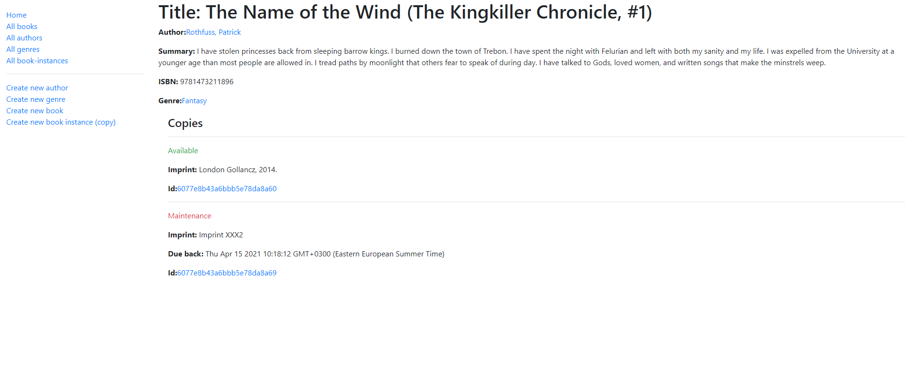
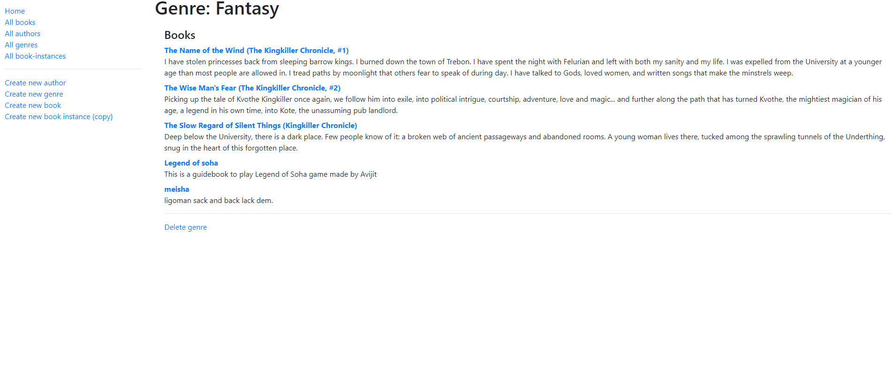

# Locallibrary_expressjs_nodeJs

The aim of this project was to recreate a local library based on given instruction in MDN documentation. This project used nodejs and expressjs framework to create a crud application that can create, edit, delete and update book information. Users can create book instances, add book to the library database. The books are stored based on authors and genre. User can see what books are available from book list. There is an option to check books of their favorite authors. User can also search for genre specific books. User can reserve or loan books from library by creating a book instance.

## Project Display




## Built With

- Html
- Css
- Vanila Js
- VS code
- Node Js
- Express Js
- MongoDB

# Getting Started

To get a local copy of the repository please run the following commands on your terminal:

```
$ cd <folder>
```

```bash

$ git clone `https://github.com/ajkacca457/Locallibrary_expressjs_nodeJs.git`
$ cd Locallibrary_expressjs_nodeJs
$ Run `npm install` to install the necessary modules
$ Run `npm run start` to open app in localhost.

```

# Authors

👤 **Avijit Karmaker**

- Github: [@Avijit](https://github.com/ajkacca457)
- Linkedin: [@Avijit](https://www.linkedin.com/in/avijit-karmaker-8738a54)

## 🤝 Contributing

Contributions, issues and feature requests are welcome!

## Show your support

Give a ⭐️ if you like this project!

## Copyright

This is a project developed by Avijit.
